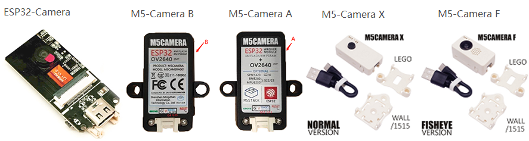

# 摄像机单元固件

[English](https://github.com/m5stack/m5stack-cam-psram/blob/master/README.md) | 中文

现在，M5Stack有四种类型的摄像机单元，分别有[ESP32CAM](https://docs.m5stack.com/#/zh_CN/unit/esp32cam)，[M5Camera (A Model)](https://docs.m5stack.com/#/zh_CN/unit/m5camera)，[M5Camera (B Model)](https://docs.m5stack.com/#/zh_CN/unit/m5camera)，M5CameraX，[M5CameraF](https://docs.m5stack.com/#/zh_CN/unit/m5camera_f)。



这些相机之间的主要区别是**内存**，**接口**，**镜头**，**可选硬件**和**相机外壳**。

## 固件说明

该仓库的代码适于这些板子，每个文件夹对应一种功能。

- [mpu6050](https://github.com/m5stack/m5stack-cam-psram/tree/master/mpu6050) -> 焊接 MPU6050 芯片之后，陀螺仪的例程 (idf-3.3)

- [qr](https://github.com/m5stack/m5stack-cam-psram/tree/master/qr) -> 二维码识别的例程 (idf-3.3)

- [uart](https://github.com/m5stack/m5stack-cam-psram/tree/master/uart) -> 与 [M5Core](https://docs.m5stack.com/#/zh_CN/core/basic) 之间进行串口通信的例程 (idf-3.3)

- [wifi](https://github.com/m5stack/m5stack-cam-psram/tree/master/wifi) -> 通过 WIFI 传输图像的例程 (idf-4.0)

- [face_recognize](https://github.com/m5stack/m5stack-cam-psram/tree/master/face_recognize) -> 人脸识别的例程 (idf-3.3)

**注意，在编译下载代码之前，需要先执行以下操作，配置成对应的板子。**

第一步：搭建 ESP-IDF 开发环境

- [https://docs.espressif.com/projects/esp-idf/en/latest/get-started/index.html](https://docs.espressif.com/projects/esp-idf/en/latest/get-started/index.html)

第二步：搭建好 ESP-IDF 环境之后，在终端 Terminal 中，执行 `make menuconfig`

第三步：配置摄像头型号


第四步：打开psram


第五步：在终端 Terminal 中，执行 `make`，确保编译无误

第六步：在终端 Terminal 中，执行 `make flash`，下载程序

第七步：在终端 Terminal 中，执行 `make monitor`，打开串口监视

### 不同版本相机的比较 ( ESP32CAM, M5Camera (A Model), M5Camera (B Model), M5CameraF )

下图是他们的对照表。 （注意：因为接口有很多不同的引脚，所以我做了一个单独的表进行比较。）

- 如果你想**查看**与它们的详细区别，请点击[这里](https://shimo.im/sheets/gP96C8YTdyjGgKQC)。

- 如果您想**下载**细节差异，请点击[这里](https://github.com/m5stack/M5-Schematic/blob/master/Units/m5camera/M5%20Camera%20Detailed%20Comparison.xlsx)。


#### 引脚比较


<!-- #### 界面差异

下表显示了基于`Interface Comparison`表的相机电路板之间的接口差异。

 -->

## 重要的是要记住

- 除了使用带有JPEG或CIF更低分辨率外，驱动程序还需要安装和激活PSRAM。
- 使用YUV或RGB会给芯片带来很大的压力，因为写入PSRAM并不是特别快。 结果是图像数据可能丢失。 如果启用WiFi，则尤其如此。 如果您需要RGB数据，建议使用`fmt2rgb888`或`fmt2bmp`/`frame2bmp`捕获JPEG然后转换为RGB。
- 当使用1帧缓冲区时，驱动程序将等待当前帧完成（VSYNC）并启动I2S DMA。 获取帧后，I2S将停止，帧缓冲区返回到应用程序。 这种方法可以更好地控制系统，但会导致获得帧的时间更长。
- 当使用2个或更多帧缓冲时，I2S以连续模式运行，每个帧被推送到应用程序可以访问的队列。 这种方法会给CPU/Memory带来更大的压力，但允许帧速率加倍。 请仅使用JPEG。

## API

### Get img data
0
```c
camera_fb_t * fb = NULL;
// will get a img frame
fb = esp_camera_fb_get();
// img buf
uint8_t *buf = fb->buf;
// img buf len
unit32_t buf_len = fb->len;

/* --- do some something --- */

// need return img buf
esp_camera_fb_return(fb);
```

### Set ov2640 config

```c
sensor_t *s = esp_camera_sensor_get();
s->set_framesize(s, FRAMESIZE_VGA);
s->set_quality(s, 10);
s->set_vflip(s, 1);
s->set_hmirror(s, 1);
...
```

Detailed view [sensor.h](https://github.com/m5stack/m5stack-cam-psram/blob/master/mpu6050/components/esp32-camera/driver/include/sensor.h)

## Examples

### Initialization

```c
#include "esp_camera.h"

static camera_config_t camera_config = {
    .pin_reset = CAM_PIN_RESET,
    .pin_xclk = CAM_PIN_XCLK,
    .pin_sscb_sda = CAM_PIN_SIOD,
    .pin_sscb_scl = CAM_PIN_SIOC,

    .pin_d7 = CAM_PIN_D7,
    .pin_d6 = CAM_PIN_D6,
    .pin_d5 = CAM_PIN_D5,
    .pin_d4 = CAM_PIN_D4,
    .pin_d3 = CAM_PIN_D3,
    .pin_d2 = CAM_PIN_D2,
    .pin_d1 = CAM_PIN_D1,
    .pin_d0 = CAM_PIN_D0,
    .pin_vsync = CAM_PIN_VSYNC,
    .pin_href = CAM_PIN_HREF,
    .pin_pclk = CAM_PIN_PCLK,

    //XCLK 20MHz or 10MHz
    .xclk_freq_hz = 20000000,
    .ledc_timer = LEDC_TIMER_0,
    .ledc_channel = LEDC_CHANNEL_0,

    .pixel_format = PIXFORMAT_JPEG,//YUV422,GRAYSCALE,RGB565,JPEG
    .frame_size = FRAMESIZE_UXGA,//QQVGA-UXGA Do not use sizes above QVGA when not JPEG

    .jpeg_quality = 12, //0-63 lower number means higher quality
    .fb_count = 1 //if more than one, i2s runs in continuous mode. Use only with JPEG
};

esp_err_t camera_init(){
    //power up the camera if PWDN pin is defined
    if(CAM_PIN_PWDN != -1){
        pinMode(CAM_PIN_PWDN, OUTPUT);
        digitalWrite(CAM_PIN_PWDN, LOW);
    }

    //initialize the camera
    esp_err_t err = esp_camera_init(&camera_config);
    if (err != ESP_OK) {
        ESP_LOGE(TAG, "Camera Init Failed");
        return err;
    }

    return ESP_OK;
}

esp_err_t camera_capture(){
    //acquire a frame
    camera_fb_t * fb = esp_camera_fb_get();
    if (!fb) {
        ESP_LOGE(TAG, "Camera Capture Failed");
        return ESP_FAIL;
    }
    //replace this with your own function
    process_image(fb->width, fb->height, fb->format, fb->buf, fb->len);

    //return the frame buffer back to the driver for reuse
    esp_camera_fb_return(fb);
    return ESP_OK;
}
```

### JPEG HTTP Capture

```c
#include "esp_camera.h"
#include "esp_http_server.h"
#include "esp_timer.h"

typedef struct {
        httpd_req_t *req;
        size_t len;
} jpg_chunking_t;

static size_t jpg_encode_stream(void * arg, size_t index, const void* data, size_t len){
    jpg_chunking_t *j = (jpg_chunking_t *)arg;
    if(!index){
        j->len = 0;
    }
    if(httpd_resp_send_chunk(j->req, (const char *)data, len) != ESP_OK){
        return 0;
    }
    j->len += len;
    return len;
}

esp_err_t jpg_httpd_handler(httpd_req_t *req){
    camera_fb_t * fb = NULL;
    esp_err_t res = ESP_OK;
    size_t fb_len = 0;
    int64_t fr_start = esp_timer_get_time();

    fb = esp_camera_fb_get();
    if (!fb) {
        ESP_LOGE(TAG, "Camera capture failed");
        httpd_resp_send_500(req);
        return ESP_FAIL;
    }
    res = httpd_resp_set_type(req, "image/jpeg");
    if(res == ESP_OK){
        res = httpd_resp_set_hdr(req, "Content-Disposition", "inline; filename=capture.jpg");
    }

    if(res == ESP_OK){
        if(fb->format == PIXFORMAT_JPEG){
            fb_len = fb->len;
            res = httpd_resp_send(req, (const char *)fb->buf, fb->len);
        } else {
            jpg_chunking_t jchunk = {req, 0};
            res = frame2jpg_cb(fb, 80, jpg_encode_stream, &jchunk)?ESP_OK:ESP_FAIL;
            httpd_resp_send_chunk(req, NULL, 0);
            fb_len = jchunk.len;
        }
    }
    esp_camera_fb_return(fb);
    int64_t fr_end = esp_timer_get_time();
    ESP_LOGI(TAG, "JPG: %uKB %ums", (uint32_t)(fb_len/1024), (uint32_t)((fr_end - fr_start)/1000));
    return res;
}
```

### JPEG HTTP Stream

```c
#include "esp_camera.h"
#include "esp_http_server.h"
#include "esp_timer.h"

#define PART_BOUNDARY "123456789000000000000987654321"
static const char* _STREAM_CONTENT_TYPE = "multipart/x-mixed-replace;boundary=" PART_BOUNDARY;
static const char* _STREAM_BOUNDARY = "\r\n--" PART_BOUNDARY "\r\n";
static const char* _STREAM_PART = "Content-Type: image/jpeg\r\nContent-Length: %u\r\n\r\n";

esp_err_t jpg_stream_httpd_handler(httpd_req_t *req){
    camera_fb_t * fb = NULL;
    esp_err_t res = ESP_OK;
    size_t _jpg_buf_len;
    uint8_t * _jpg_buf;
    char * part_buf[64];
    static int64_t last_frame = 0;
    if(!last_frame) {
        last_frame = esp_timer_get_time();
    }

    res = httpd_resp_set_type(req, _STREAM_CONTENT_TYPE);
    if(res != ESP_OK){
        return res;
    }

    while(true){
        fb = esp_camera_fb_get();
        if (!fb) {
            ESP_LOGE(TAG, "Camera capture failed");
            res = ESP_FAIL;
        } else {
            if(fb->format != PIXFORMAT_JPEG){
                bool jpeg_converted = frame2jpg(fb, 80, &_jpg_buf, &_jpg_buf_len);
                if(!jpeg_converted){
                    ESP_LOGE(TAG, "JPEG compression failed");
                    esp_camera_fb_return(fb);
                    res = ESP_FAIL;
                }
            } else {
                _jpg_buf_len = fb->len;
                _jpg_buf = fb->buf;
            }
        }
        if(res == ESP_OK){
            size_t hlen = snprintf((char *)part_buf, 64, _STREAM_PART, _jpg_buf_len);

            res = httpd_resp_send_chunk(req, (const char *)part_buf, hlen);
        }
        if(res == ESP_OK){
            res = httpd_resp_send_chunk(req, (const char *)_jpg_buf, _jpg_buf_len);
        }
        if(res == ESP_OK){
            res = httpd_resp_send_chunk(req, _STREAM_BOUNDARY, strlen(_STREAM_BOUNDARY));
        }
        if(fb->format != PIXFORMAT_JPEG){
            free(_jpg_buf);
        }
        esp_camera_fb_return(fb);
        if(res != ESP_OK){
            break;
        }
        int64_t fr_end = esp_timer_get_time();
        int64_t frame_time = fr_end - last_frame;
        last_frame = fr_end;
        frame_time /= 1000;
        ESP_LOGI(TAG, "MJPG: %uKB %ums (%.1ffps)",
            (uint32_t)(_jpg_buf_len/1024),
            (uint32_t)frame_time, 1000.0 / (uint32_t)frame_time);
    }

    last_frame = 0;
    return res;
}
```

### BMP HTTP Capture

```c
#include "esp_camera.h"
#include "esp_http_server.h"
#include "esp_timer.h"

esp_err_t bmp_httpd_handler(httpd_req_t *req){
    camera_fb_t * fb = NULL;
    esp_err_t res = ESP_OK;
    int64_t fr_start = esp_timer_get_time();

    fb = esp_camera_fb_get();
    if (!fb) {
        ESP_LOGE(TAG, "Camera capture failed");
        httpd_resp_send_500(req);
        return ESP_FAIL;
    }

    uint8_t * buf = NULL;
    size_t buf_len = 0;
    bool converted = frame2bmp(fb, &buf, &buf_len);
    esp_camera_fb_return(fb);
    if(!converted){
        ESP_LOGE(TAG, "BMP conversion failed");
        httpd_resp_send_500(req);
        return ESP_FAIL;
    }

    res = httpd_resp_set_type(req, "image/x-windows-bmp")
       || httpd_resp_set_hdr(req, "Content-Disposition", "inline; filename=capture.bmp")
       || httpd_resp_send(req, (const char *)buf, buf_len);
    free(buf);
    int64_t fr_end = esp_timer_get_time();
    ESP_LOGI(TAG, "BMP: %uKB %ums", (uint32_t)(buf_len/1024), (uint32_t)((fr_end - fr_start)/1000));
    return res;
}
```
