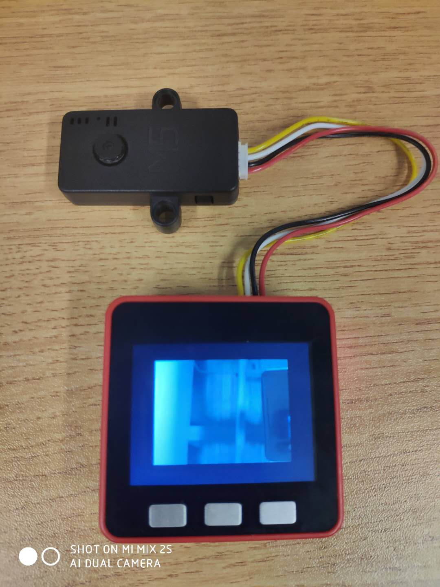

# M5Stack Camera with psram base in [esp32-camera](https://github.com/espressif/esp32-camera.git)

## General Information

This repository hosts ESP32 compatible driver for OV2640 image sensors. Additionally it provides a few tools, which allow converting the captured frame data to the more common BMP and JPEG formats.

## Important to Remember

- Except when using CIF or lower resolution with JPEG, the driver requires PSRAM to be installed and activated.
- Using YUV or RGB puts a lot of strain on the chip because writing to PSRAM is not particularly fast. The result is that image data might be missing. This is particularly true if WiFi is enabled. If you need RGB data, it is recommended that JPEG is captured and then turned into RGB using `fmt2rgb888` or `fmt2bmp`/`frame2bmp`.
- When 1 frame buffer is used, the driver will wait for the current frame to finish (VSYNC) and start I2S DMA. After the frame is acquired, I2S will be stopped and the frame buffer returned to the application. This approach gives more control over the system, but results in longer time to get the frame.
- When 2 or more frame bufers are used, I2S is running in continuous mode and each frame is pushed to a queue that the application can access. This approach puts more strain on the CPU/Memory, but allows for double the frame rate. Please use only with JPEG.

## Installation Instructions

- Clone or download and extract the repository to the components folder of your ESP-IDF project
- Make 

## Arduino file in [here](arduino/main.c)

- try to copy main.c file to your new arduino project
- make it and dowmload

## Line connect
